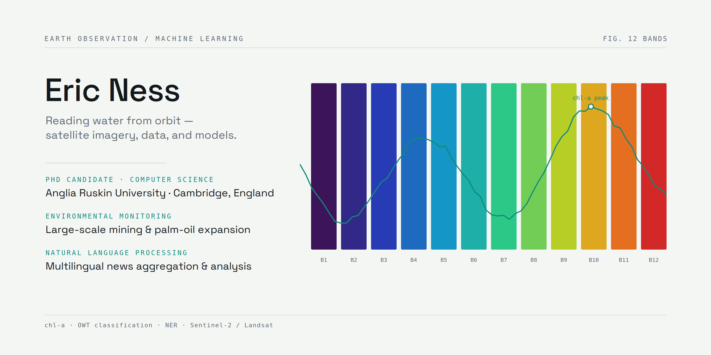

### Hi there 👋

I'm Eric Ness.

I build software for working with environmental data, and I’m currently a PhD candidate in Computer Science at Anglia Ruskin University.

A lot of my research is around using satellite imagery, machine learning, and large environmental datasets to better understand water quality.

Things I’m usually working on or thinking about:

* 🛰️ Remote sensing
* 🌊 Environmental and water quality data
* 🤖 Machine learning and AI
* 🗺️ Geospatial software
* 📰 News analysis applications
* 🍿 Popcorn

